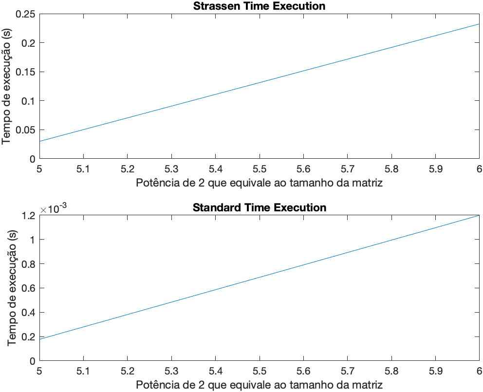

# Strassen Matlab

Está implementação foi desenvolvida para avaliação na disciplina de Estrutura de Dados e Análise de Algoritmos, e tem a seguinte descrição: Neste trabalho, vocês deverão implementar e comparar dois algoritmos para o cálculo do produto AB, sendo A e B duas matrizes quadradas de ordem n: o algoritmo “ingênuo”, que consiste simplesmente em aplicar diretamente a definiçãoao do produto de matrizes; e o algoritmo de Strassen, descrito no capítulo 4 do livro-texto. A comparação entre os dois algoritmos será na forma de um gráfico relativo a diversas execuções com matrizes aleatórias de ordens variáveis. Deverão ser utilizados os seguintes parâmetros, os quais serão espeficados através de um arquivo de texto:

- nmax: valor m áximo de n considerado (deve ser potências de 2);
- r: número de matrizes geradas para cada valor de n;
- [amin,amax]: intervalo ao qual os elementos das matrizes geradas devem pertencer. Todos os elementos devem ser números inteiros.

## Execução

Para executar o código de forma nativa, você precisa instalar [Matlab](https://www.mathworks.com/products/matlab.html) na sua máquina e na linha de comando do software você deve executar o seguinte comando:

````
runner('input.txt');
````

## Resultados

Esta aplicação gera uma imagem com dois gráficos comparativos entre as abordagem, marcando o tempo em microsegundos, como mostra a figura abaixo. Também é gerado um arquivo do tipo csv para outros fins.



## Extra

Foi criado um código semelhante na linguagem c++, o código pode ser encontrado neste [repositório](https://google.com).

## Autores

* **Leoberto Soares**- [leossoaress](https://github.com/leossoaress)

## License

This project is licensed under the MIT License - see the [LICENSE.md](LICENSE.md) file for details
